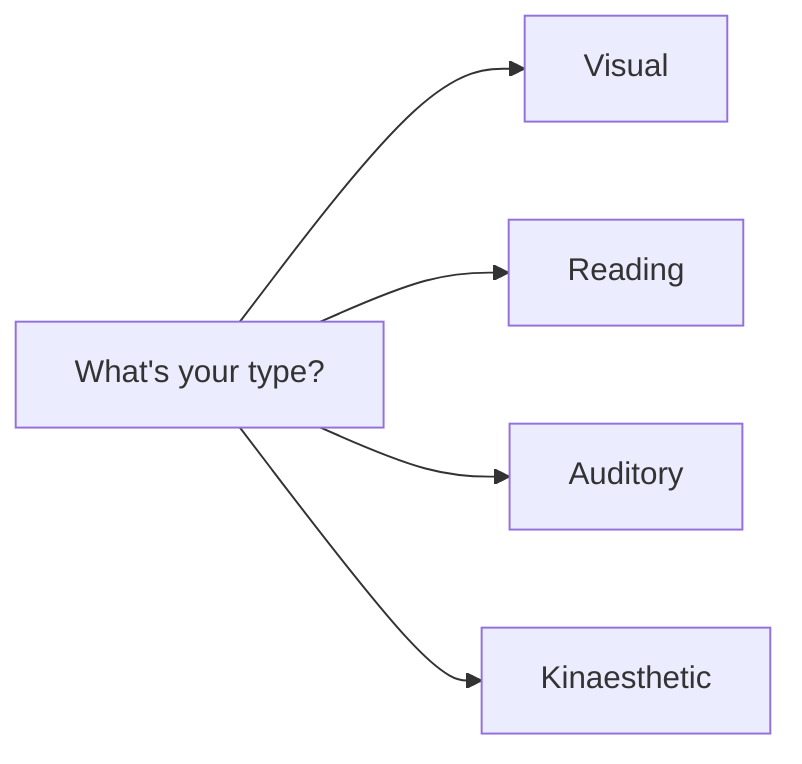
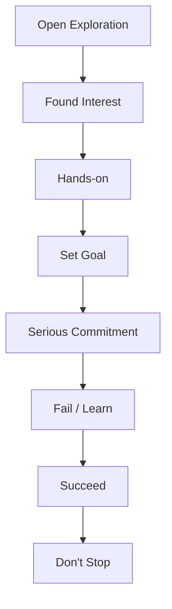

   

*"Set your Goals - Journey to Graduation"*

### Topics:

Before we start

Let's take 2 polls. Open [rb.gy/wgpodn](https://app.sli.do/event/4FL1a6NFocFqcc3gE7QoSq/polls) or Scan QR

  

Poll Question-1

Q. Which superpower would you most like to have? (choose one)
 

Poll Question-2

Q. If you weren’t at college, what else would you be doing? (write in 1 or 2 words)
 

If you get **Doubts** or **Questions** during the session? Ask them on 
 (Vote for the questions you like and I'll answer them first)

How to Learn?

#### Approach
Find a topic that excites you, learn it, put it to use.

#### Resources
- online/meetups/workshops/courses
- Tech Stack: open-source, local machine, on-cloud (AWS, GCP, Azure) with Free credits
- Must-knows:
    - Fundamentals of CS,
    - DS and Basic Algos,
    - Programming Paradigms(Declarative vs Imperative),
    - Security: Refer to recent Hacks costing companies in millions of $$$
    - System Design: Building Scalable software is more important than ever due to load!
    - Tools(CLI, Git, IDEs)
 

 

## Where's Refresh?
> *Is there a <kbd>CTRL</kbd>+<kbd>R</kbd> for our brain?*

#### Learn, Unlearn, Relearn!

Read about [How to Unlearn?](https://trainingindustry.com/articles/strategy-alignment-and-planning/unlearning-in-the-time-of-continuous-learning/)

But what if I fall in the Tutorial Hell ??

  

> Don't get stuck in the tutorial loop!

Read this article on [How to break out of Tutorial loop?](https://betterprogramming.pub/stuck-in-the-tutorial-loop-as-a-developer-2d1a3f76c941)

Collaboration

- CP platforms(competitive): , , [takeuforward.org](https://takeuforward.org/)
- Inter-college Hackathons, Technical Presentations.
- Team projects
- Build upon an Idea!

and...

Experience

- Build products: in a small team(2-3)
- Join a startup as an intern: Friend's reference, or look for Job posting via Career sites or LinkedIn jobs portal.

### It's Break time!
Poll time...

Showcase

- GitHub Profile READMEs: Use `github-readme-stats` project by [Anurag Hazra](https://github.com/anuraghazra)

- Portfolio Website: Create websites and host them on GitHub Pages (search for open-source [Portfolio-Website](https://github.com/topics/portfolio-website)  projects). An eg. portfolio:

Brace yourselves!

<em>You're not unique!</em>

<em>but...</em>

<em>That also means, you're not alone!</em>

 

- Procrastination
- Phone Use
- Distracted on Social Media - low attention span
- Unprepared
- Lack of Focus!

What's the big QUESTION?

<em>Who’s in charge of your future? Oh, right, it’s you.!</em>

Life Hacks

- Surround yourself with goal-oriented, ambitious folks!

- Overcome procrastination, distractions, attention-deficit!

- Follow your inspiration! (on LinkedIn, Twitter)

- Strengthen your Engine (health: Physical & Mental well-being is critical to achieve your Goals)

How to build your Passion? (in 30 days)

